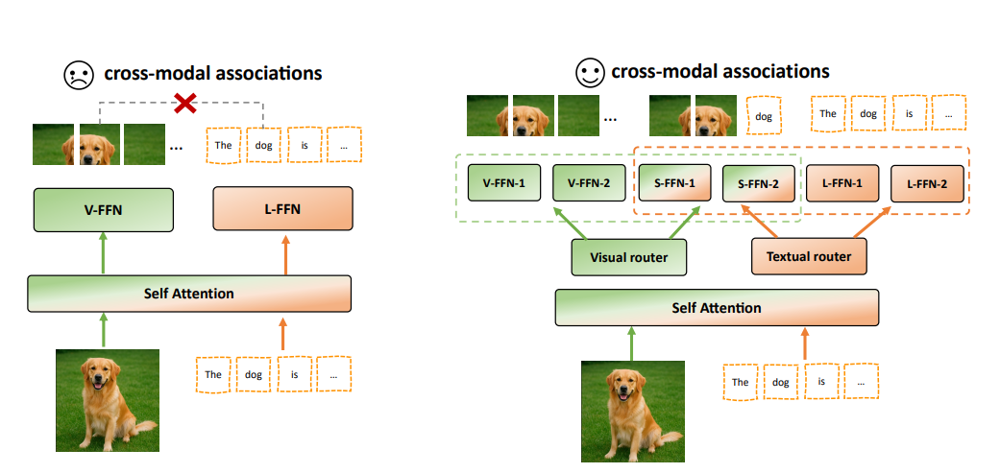

# MoIIE: Mixture of Intra- and Inter-Modality Experts for Large Vision Language Models




## Release
- [2025/08/01] 🔥 We have released **training and evaluation codes**. 

## Contents
- [Install](#install)
- [Train](#train)
- [Evaluation](#evaluation)

### Install
* CUDA and cuDNN

  We use CUDA 11.8 and cuDNN 8.7.0. We actually use the CUDA docker by NVIDIA: `docker pull nvcr.io/nvidia/cuda:11.8.0-cudnn8-devel-ubuntu20.04`. CUDA 12 is fine, too.

* Create a conda virtual environment and activate it:

  ```shell
  conda create -n bunny python=3.10
  conda activate bunny
  ```


  ```shell
  pip install --upgrade pip  # enable PEP 660 support
  ```

* Install apex

  ```shell
  # https://github.com/NVIDIA/apex#from-source
  pip install ninja
  git clone https://github.com/NVIDIA/apex
  cd apex
  # if pip >= 23.1 (ref: https://pip.pypa.io/en/stable/news/#v23-1) which supports multiple `--config-settings` with the same key...
  pip install -v --disable-pip-version-check --no-cache-dir --no-build-isolation --config-settings "--build-option=--cpp_ext" --config-settings "--build-option=--cuda_ext" ./
  # otherwise
  pip install -v --disable-pip-version-check --no-cache-dir --no-build-isolation --global-option="--cpp_ext" --global-option="--cuda_ext" ./
  ```

* Install flash-attention

  ```shell
  # https://github.com/Dao-AILab/flash-attention?tab=readme-ov-file#installation-and-features
  pip install packaging
  pip install flash-attn --no-build-isolation
  ```

* Install bunny and other requirements

  ```shell
  cd Bunny
  pip install -e .
  ```
### Training

MoIIE is trained on 8 A100 GPUs. Under other circumstances, you can reduce the `per_device_train_batch_size` and increase the `gradient_accumulation_steps` accordingly. Always keep the global batch size the same: `global_batch_size ` = `per_device_train_batch_size` $`\times`$ `gradient_accumulation_steps` $`\times`$ `num_gpus`.

* Experiments model components


| Vision Encoders            | Download Link                                                |
| -------------------------- | ------------------------------------------------------------ |
| siglip-so400m-patch14-384  | [google/siglip-so400m-patch14-384](https://huggingface.co/google/siglip-so400m-patch14-384) |


| MODEL_TYPE | LLM             | Download Link                                                |
| ---------- | --------------- | ------------------------------------------------------------ |
| phi-3 | Phi-3-mini-4k-instruct | [microsoft/Phi-3-mini-4k-instruct](https://huggingface.co/microsoft/Phi-3-mini-4k-instruct) |
| llama3-8b | Meta-Llama-3-8B-Instruct | [meta-llama/Meta-Llama-3-8B-Instruct](https://huggingface.co/meta-llama/Meta-Llama-3-8B-Instruct) |

MoIIE training consists of two stages: 

#### Pretrain stage

Pretrain stage use data to connect a *frozen pretrained* vision encoder to a *frozen* LLM, and only the connector is trained 

Training script with DeepSpeed ZeRO-2 can be found in ```scripts/train/pretrain.sh```. Global Batch Size is 256

we utilize Bunny-pretrain-LAION-2M. The dataset is available [here](https://huggingface.co/datasets/BoyaWu10/Bunny-v1_1-data).

#### Visual instruction tuning stage&&Sparse training
Visual instruction tuning stage&&Sparse training for all model parameters: use data to teach the model to follow multimodal instructions, where the connector, learnable LLM parameters vision encoder and MoE module are updated.

First, execute the following command to initialize the dense LLM backbone as its corresponding sparse MoE LLM backbone. 

  ```shell
python convert_moe.py \
        --language-model-path path/to/base_llm_model  \
        --num_local_experts 4 \
        --num_experts_per_tok 2 \
        --vis_router_aux_loss_coef 0.001 \
        --lan_router_aux_loss_coef 0.001 \
        --output_vis_router_logits True \
        --output_lan_router_logits True \
        --save-model-path  /path/to/base_llm_moe_model \
        --moe_architecture bunny-mm-phi3-moe-s
  ```

Than training script with DeepSpeed ZeRO-3 can be found in ```scripts/train/finetune_all_moe.sh```. Global Batch Size is 128

we utilize [MGM-Intruct]([YanweiLi/MGM-Instruction](https://huggingface.co/datasets/YanweiLi/MGM-Instruction)) ,[Bunnyv1_1](https://huggingface.co/datasets/BoyaWu10/Bunny-v1_1-data), [LLaVA-Next](lmms-lab/LLaVA-NeXT-Data) and [LLaVA-OV](https://github.com/LLaVA-VL/LLaVA-NeXT) data for experiments.

* Run

  Update `--model_name_or_path` and `--vision_tower` to the paths of the base_llm_moe_model and vision encoder, respectively. Update `MODEL_TYPE`, `PRETRAIN_DIR` and `OUTPUT_DIR` accordingly. The global batch size is 128. For `MODEL_TYPE = mms-phi-3-moe(MoIIE)/phi-3-moe(Vanilla MoE)/m-phi-3(Modality MoE)/phi-3(Dense)`, change `--version` to `minicpm/phi3/llama`, too. S$`^2`$-Wrapper would be enabled if `--use_s2 True` added. The vision encoder would be tuned if `--unfreeze_vision_tower True` added. If only want to tune MoE layer `--moe_enable  True` added.


## Evaluation

see [evaluation_full.md](script/eval/full/evaluation.md).


## Acknowledgement
- [LLaVA](https://github.com/haotian-liu/LLaVA): the dataset we utilized.
- [Bunny](https://github.com/BAAI-DCAI/Bunny): the codebase we built upon and the dataset we utilized.
- [LLaVA-Next](https://github.com/LLaVA-VL/LLaVA-NeXT): the dataset we utilized.
- [MGM](https://github.com/dvlab-research/MGM) the dataset we utilized.
- [Cambrian-1](https://github.com/cambrian-mllm/cambrian): the evaluation codebase we utilized.
